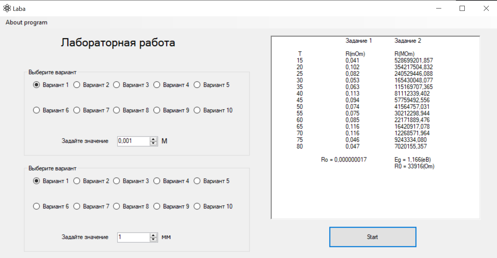
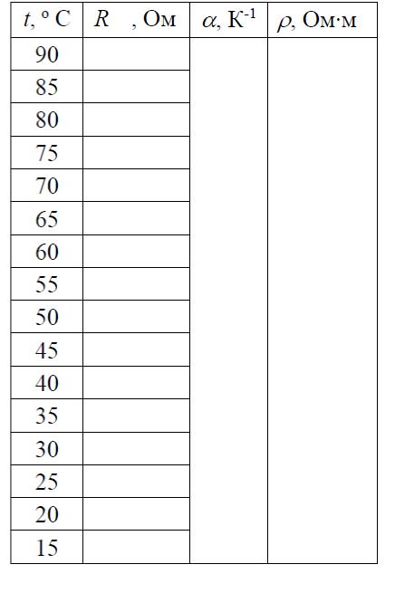
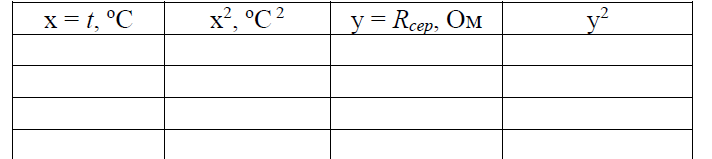
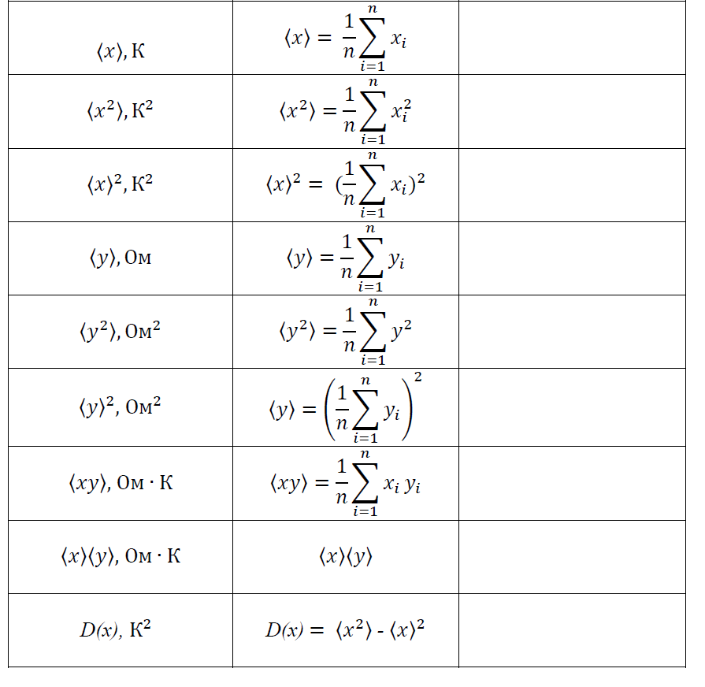
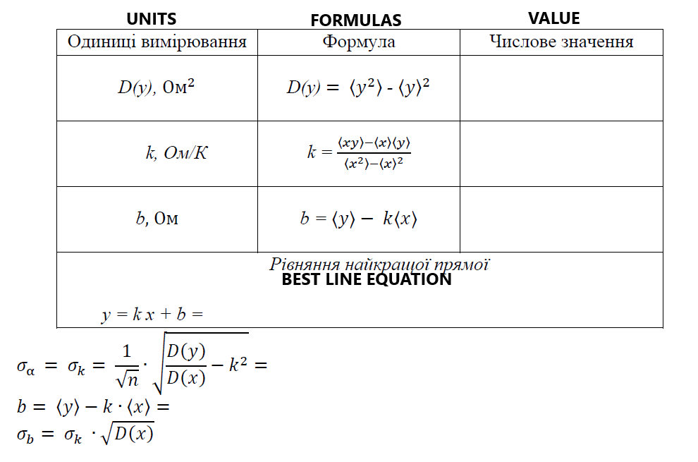

##About
This program is <b>laboratory simulation</b> for student of university or other school with advance study of physics. You will be able to look and made laboratory work on the topic of "<em>TEMPERATURE DEPENDENCE OF ELECTRIC CONDUCTIVITY OF SOLIDS</em>". Interface of program is a window(create by c++), which have two option; first - dependence resistance of <samp>metal</samp>; second - dependence resistor of <samp>semiconductors</semp>.

This simulation will help...

* ...develop skill in this area.

* ...verify skill, which you(our students) have.

* ...diversify studying process.

##How it works

<samp>Screenshot of the program</samp>

When open the program you need to select option for the first and second task and you need to input value for <samp>length</samp>(<b>M</b>) of conductor and a <samp>diameter</samp>(<b>mm</b>).

Next stage is press to button under the text field.

You see a 2 columns with calculation result.

##How to solve it

<b>TASK 1</b>

You need to copy the first column to Exel(of course, if you are android - you can make calculations in your head or piece of paper), so you need to build spreadsheets and fill in it(use this formulas):

<h2>Congratulation! If you do everything is correct, your results are equal results under columns</h2>
